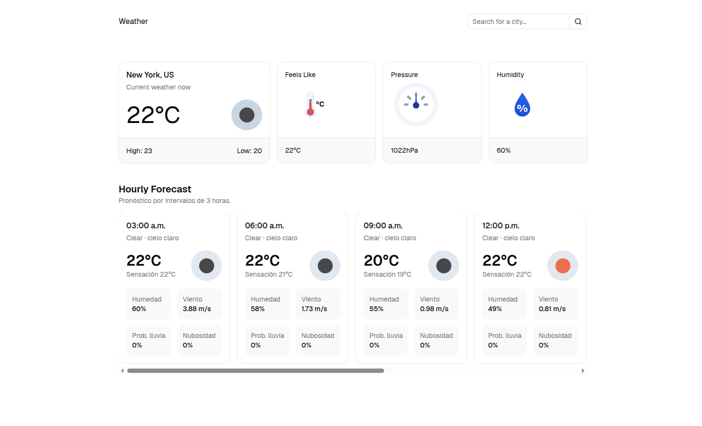

# Weather App

## Overview

This project is a weather dashboard built with React and TypeScript. It displays the current weather and an hourly forecast using data from a weather API, with a clean UI built around shadcn/ui cards and reusable components.

The main goal of the project was to practice building a small but complete frontend application: fetching remote data, modeling API responses with TypeScript, and presenting information in a clear and responsive interface.

## How the Project Was Built

1. The application was created with Vite to keep the development setup fast and lightweight.
2. React was used to split the UI into focused components such as the navbar, dashboard, current weather card, and hourly forecast section.
3. TypeScript types were defined first to describe the expected API responses and reduce mistakes while working with the data.
4. A custom weather hook was used to centralize the data fetching logic and keep the components easy to read.
5. shadcn/ui cards were used to present the weather information in a structured and consistent layout.
6. Tailwind CSS utilities were used for spacing, alignment, responsiveness, and visual hierarchy.

## Tools Used

- React
- TypeScript
- Vite
- Tailwind CSS
- shadcn/ui
- Custom hooks
- OpenWeather API

## What I Learned

This project reinforced several practical frontend skills:

- How to model API responses with TypeScript before building the UI.
- How to structure a React app into reusable and maintainable components.
- How to use shadcn/ui components as building blocks for a consistent interface.
- How to keep weather data readable by choosing only the most useful values for each card.
- How to build responsive layouts that work well on desktop and mobile.

## Project Image

## Deployed Project

Netlify URL: https://weather-app-alan.netlify.app/
